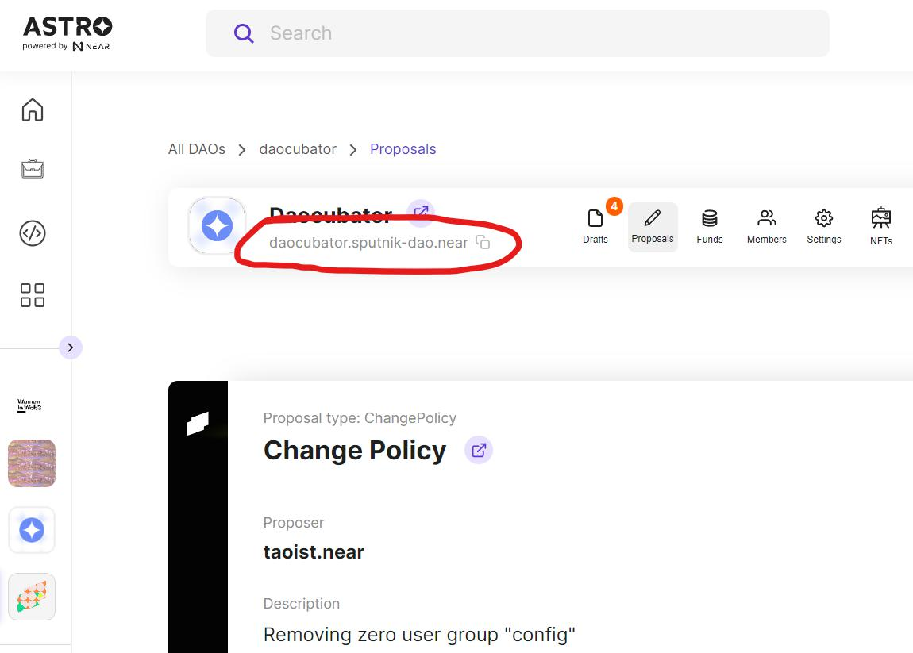
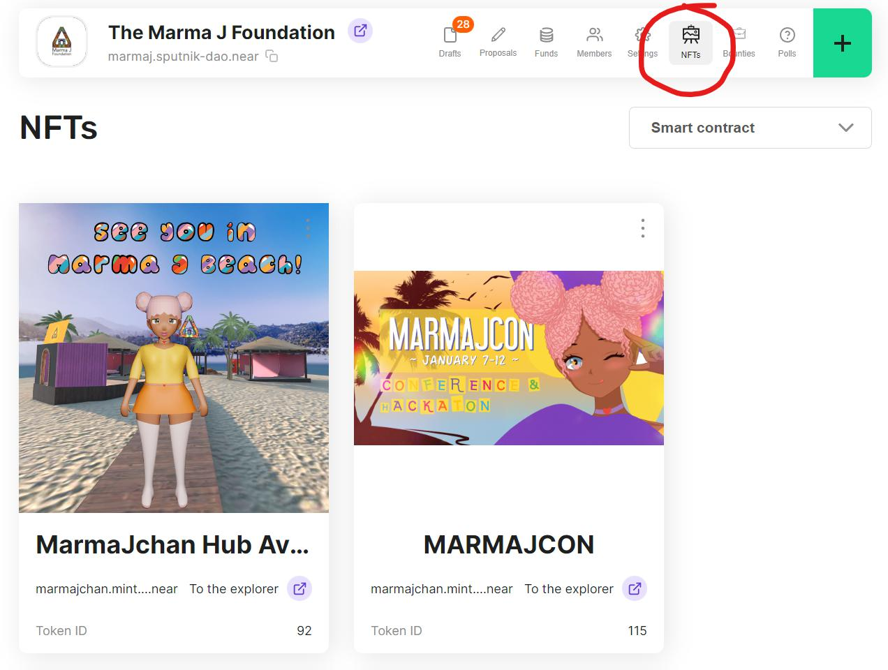

Managing assets is one of the top reasons people create DAOs, so it's good to know how to send assets to a DAO and to see the assets it holds.

# Sending Assets to a DAO

When it comes to assets, a DAO works like any other wallet. Anyone can send NEAR, Fungible Tokens, or NFTs to a DAO. Those assets will be as secure, if not more secure, than assets held in your individual wallet. 

To send assets to a DAO you'll need to know it's address. To find a DAOs address on Astro you navigate to the DAOs page. DAOs created on Astro will all have ".sputnik-dao.near" as part of their name, as you can see below.

# Seeing Assets into a DAO

If someone sends you the name of a DAO you may want to double check that it's legit before transferring assets. The easiest way to check on a DAO is by finding it on Astro using the search bar. 

Once you find the DAO you can check that it's valid by visiting the different pages using the DAO nav bar. For example, you can visit the funds page to see how much NEAR a DAO holds. The funds page also shows the fungible tokens a DAO has in its treasury. In the same way, visiting the NFT tab of a DAO will show off any Non-fungible tokens the DAO is holding.

# Sending Assets from a DAO

Transferring assets out of a DAO requires a proposal. Depending on the DAO configuration, it may be possible for anyone to create or vote on a proposal. In another case, only DAO memebers can create or vote on a proposal. There are many other possible configurations as well.

