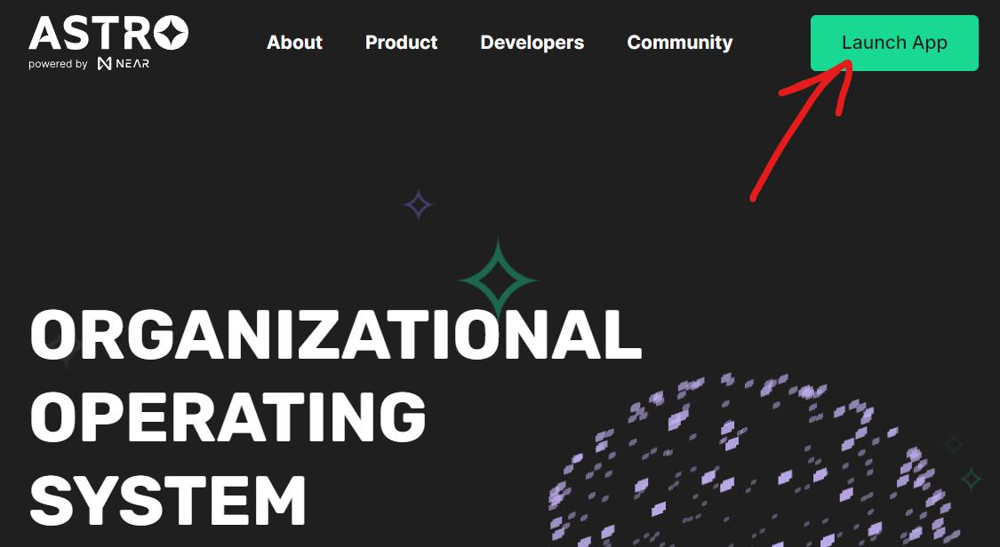
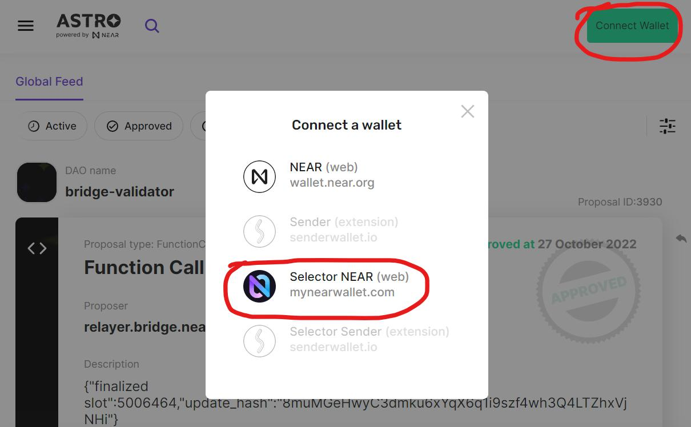
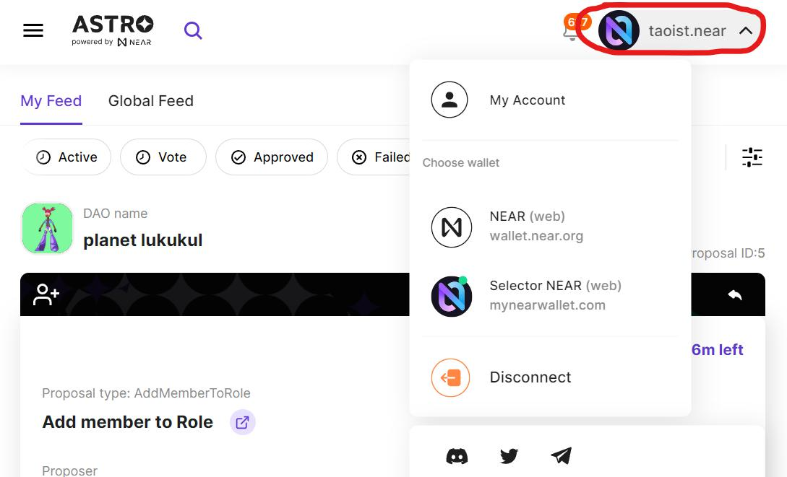

# Your NEAR Wallet

Before interacting with Astro DAOs you'll need a NEAR wallet. 

Thankfully The Kin DAO has [created a video on how to make your own wallet](https://youtu.be/e_qnOOwFTOw?t=57).

If you're new to the idea of radical self reliance you may also want to read up on [NEAR Wallet Safety & Hygiene](https://twitter.com/starpause/status/1540502613707202560).

# Logging In

**Step 1:** Launch Astro from the homepage.

**Step 2:** Hit "Connect Wallet" and then choose your preferred wallet. [MyNearWallet](MyNearWallet.com) is the default as of mid 2022. You will be asked to sign a transaction confirming that you are connecting your NEAR wallet.

**Step 3:** That's it! Always verify you're logged in with the correct NEAR name in the upper right hand corner of Astro. 

If you're having trouble logging in or Astro is behaving in unexpected ways a common fix is to clear your browser cache and cookies for astrodao.com. After doing that hard refresh of your environment you can log baack in.

# Switching Accounts 

If you have more than one wallet you may need to interact with DAOs using each of those accounts. The easiest way to switch between accounts is to use a browser that supports user profiles. Then it's as easy as switching to that profile with your browser. You'll stay logged in under each profile which makes it quick to switch between them.

Another way is to sign into different accounts on different NEAR wallets. You can then switch between those wallets inside of Astro, which also switches you between users. The downside of this approach is that you can only switch between as many accounts as you have NEAR wallets.