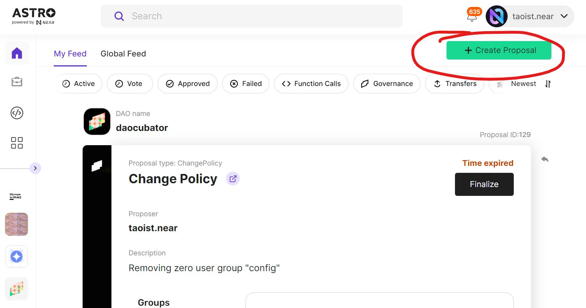
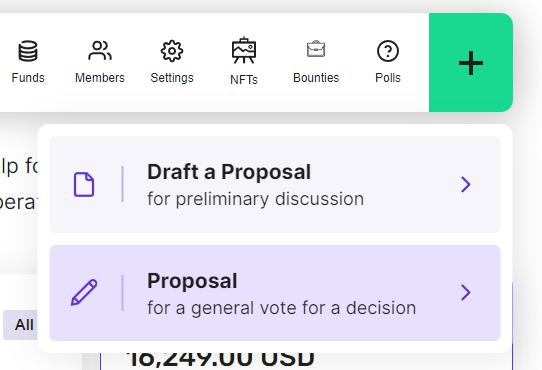
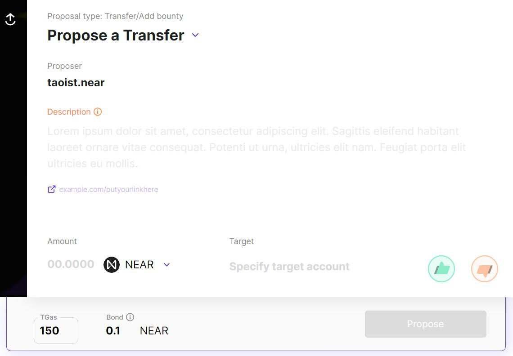

Proposals are the mechanism DAOs use to get anything done. Everything from changing the DAO logo to releasing funds from the DAO requires a proposal.

When you use NEAR as an individual user, each action you take on the chain requires your digital signature. The same is true for any action you want to take as a DAO. The difference is that as an individual you can click "approve" in your wallet. With a DAO, you would instead make a proposal. When the proposal passes, it's the same as if you had hit "approval". 

There are two main permissions which are relvant to proposals. First is the ability to *create* proposals, second is the ability to *vote* on proposals. We'll get into granular details around possible configurations in another section. 

# How to Make a Proposal

If you logged into Astro the "My Feeds" page has a button with a + sign on it. Hitting that is the first step to proposal creation. 

You can also navigate into a DAO and if you have permission to create proposals in the DAO, you will find a green + button there. Drafts allow for discussion and editing of a proposal before it's sent to the blockchain. If no discussion is necessary then go directly for creating a proposal. 

# Anatomy of a Proposal

Creating a proposal may seem daunting if you're not familiar with the required fields so lets break them down.

Starting from the top, there are many kinds of **Proposal Types**. These include managing assets like transfers of tokens, DAO configuration, and custom actions. You can change the type of proposal you're creating with the drop down selector. In the proposal type selector you can browse or quickly filter to find what you're looking for. 

The **Proposer** is you and isn't editable. You can change it by logging out and then into a different account.

**Description** is for any details beyond the standard proposal metadata. Some DAOs have their own conventions for what to include in the description. It's common to link to discussion of the proposal on a forum or the DAOs group chat. 

Under **Amount** you need to specify both the number of tokens to transfer as well as which token to transfer, with a default of NEAR. Only tokens in the treasury of the DAO you're proposing to will appear in the token type selector. 

**Target** is the account which will recieve tokens when the proposal passes. Include `.near` in the name on mainnet and `.testnet` in the name on testnet.

**TGas** defaults to 150 and can be set up to 300. If you're not doing a function call or custom DAO action then the default is safe. You can always retry a transfer if not enough gas was set but you'll get an error if gas is set too high, so it's better to go low. You can read more about the deep topic of [gas in the near.org docs]( https://docs.near.org/concepts/basics/transactions/gas). 

To prevent spam DAOs need you to put up a **Bond** when submitting a proposal. When your proposal finalizes, whether it passes or fails, the DAO will send the bond back to you. The only time you don't get your bond back is if the DAO marks your proposal as spam. 

Once those fields are complete you can double check your work and submit the proposal!